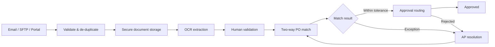
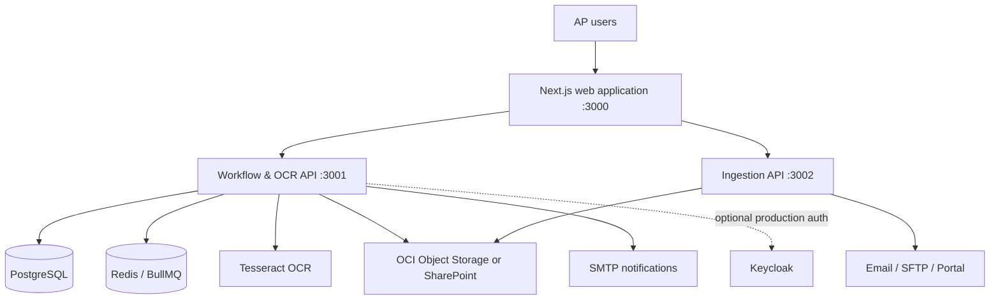

<div align="center">

# Martinrea AP Automation

**Intelligent invoice capture, OCR-assisted validation, PO matching, and approval orchestration**


</div>

> [!IMPORTANT]
> This repository contains proprietary, internal software. Do not distribute its
> source code, configuration, data, or documentation outside authorized channels.

## Overview

Martinrea AP Automation is a paperless accounts-payable platform designed to
move supplier invoices from intake to approval with less manual handling and a
complete audit trail.

This Phase 1 monorepo contains:

- A responsive AP workspace for clerks, plant managers, and finance directors
- Invoice ingestion through email, SFTP, and portal upload
- OCR extraction with confidence scoring and human review
- Purchase-order ingestion and two-way invoice matching
- Role-based, sequential approvals with rejection and exception handling
- Notifications, SLA escalation, and auditable workflow transitions

## Business workflow



## Architecture



| Layer | Technology |
| --- | --- |
| Web application | Next.js 16, React 19, TypeScript, Tailwind CSS, TanStack Query |
| Workflow and OCR | NestJS 10, Sequelize, BullMQ, Tesseract |
| Ingestion | NestJS 10, Microsoft Graph, IMAP, SFTP |
| Data and queueing | PostgreSQL, Redis |
| Identity | Local JWT for development; Keycloak/JWKS for production |
| Document storage | OCI Object Storage PAR or Microsoft SharePoint |
| Delivery | Docker Compose, Caddy, GitHub Actions |

## Repository layout

```text
.
├── frontend/                 # Next.js user interface
├── backend/
│   ├── workflow/             # Auth, OCR, matching, approvals, audit, SLA
│   └── ingestion/            # Email, SFTP, and portal intake
├── db/migrations/            # Shared Flyway SQL migrations
├── deploy/                   # VM, Docker Compose, Caddy, and Kubernetes assets
├── docs/                     # Architecture and product documentation
├── PO-Data/                  # Local purchase-order JSON drop folder
├── PO-PDFs/                  # Local purchase-order document drop folder
└── scripts/                  # Development and operational utilities
```

## Getting started

### Prerequisites

- Node.js 20 or later
- npm
- Docker Desktop
- A PostgreSQL instance and an empty `martinrea_ap` database
- Tesseract OCR available on `PATH`, or configured through
  `OCR_TESSERACT_PATH`

The local launcher starts Redis and Keycloak through Docker. PostgreSQL is not
started by the root launcher and must already be available.

### 1. Install dependencies

```bash
npm run install:all
```

### 2. Create local configuration

Create local environment files from the committed templates:

```bash
cp backend/workflow/.env.example backend/workflow/.env
cp backend/ingestion/.env.example backend/ingestion/.env
cp frontend/.env.example frontend/.env.local
```

For PowerShell, use `Copy-Item` in place of `cp`.

Review the generated files before starting:

- Set the workflow `DB_*` values for your PostgreSQL instance.
- Set ingestion to `PORT=3002` and keep `INGESTION_PROFILE=local` for an
  infrastructure-light local setup.
- Keep `AUTH_PROVIDER=local` unless a Keycloak realm is configured.
- Set `MAIL_ENABLED=false` when outbound email is not required.
- Leave optional OCI, SharePoint, IMAP, Graph, SFTP, and SMTP credentials empty
  until those integrations are needed.

> [!CAUTION]
> Never commit `.env` files, passwords, private keys, access tokens, or OCI
> pre-authenticated URLs. Use an approved secret manager outside local
> development.

### 3. Start the platform

```bash
npm run dev
```

The development launcher checks ports `3000`–`3002`, ensures Redis and Keycloak
are running, and starts all three applications.

### 4. Seed local users and approval rules

Run this after the workflow service has connected to PostgreSQL:

```bash
npm run seed
```

<details>
<summary><strong>Local demonstration accounts</strong></summary>

| Role | Email | Password |
| --- | --- | --- |
| AP Clerk | `clerk@martinrea.dev` | `Password123!` |
| Plant Manager | `pm@martinrea.dev` | `Password123!` |
| Finance Director | `fd@martinrea.dev` | `Password123!` |

These credentials are for local development only.

</details>

### Local endpoints

| Component | URL |
| --- | --- |
| AP web application | <http://localhost:3000> |
| Workflow API | <http://localhost:3001/api> |
| Swagger API documentation | <http://localhost:3001/api/docs> |
| Workflow health | <http://localhost:3001/api/health> |
| Ingestion health | <http://localhost:3002/ingestion/health> |
| Keycloak administration | <http://localhost:8080> |

## Common commands

| Command | Purpose |
| --- | --- |
| `npm run dev` | Start the complete local application stack |
| `npm run dev:backend` | Start workflow and ingestion services |
| `npm run dev:frontend` | Start only the Next.js application |
| `npm run build:backend` | Build both NestJS services |
| `npm run seed` | Seed local users and approval rules |
| `npm --prefix frontend run build` | Create a production frontend build |
| `npm --prefix backend/workflow test` | Run workflow unit tests |
| `npm --prefix backend/ingestion test` | Run ingestion unit tests |
| `npm --prefix backend/ingestion run test:e2e` | Run ingestion end-to-end tests |
| `npm --prefix frontend run lint` | Lint the frontend |

## Configuration

The root [`.env.example`](.env.example) documents the cross-service
configuration contract. Service-specific templates are located at:

- [`backend/workflow/.env.example`](backend/workflow/.env.example)
- [`backend/ingestion/.env.example`](backend/ingestion/.env.example)
- [`frontend/.env.example`](frontend/.env.example)

The most important configuration groups are:

| Area | Key variables |
| --- | --- |
| Database | `DB_HOST`, `DB_PORT`, `DB_NAME`, `DB_USERNAME`, `DB_PASSWORD` |
| Authentication | `AUTH_PROVIDER`, `JWT_SECRET`, `KEYCLOAK_*` |
| OCR and queueing | `OCR_*`, `REDIS_*`, `CONFIDENCE_THRESHOLD` |
| Storage | `OCI_PAR_URL`, `BLOB_TRANSPORT`, `SP_*` |
| Inbound channels | `MAIL_TRANSPORT`, `IMAP_*`, `GRAPH_*`, `SFTP_*` |
| Notifications | `MAIL_ENABLED`, `SMTP_*` |
| Frontend proxying | `NEXT_PUBLIC_API_BASE_URL`, `API_PROXY_TARGET`, `INGESTION_PROXY_TARGET` |

## Quality checks

Backend builds and unit tests run in GitHub Actions for every pull request and
for changes pushed to `main` or `master`.

Before opening a pull request, run:

```bash
npm run build:backend
npm --prefix backend/workflow test
npm --prefix backend/ingestion test
npm --prefix backend/ingestion run test:e2e
npm --prefix frontend run lint
npm --prefix frontend run build
```

## Deployment

The repository supports two deployment models:

1. **Backend containers** — `docker compose up --build` starts workflow and
   ingestion against externally configured PostgreSQL and storage services.
2. **Integrated VM stack** — the assets under `deploy/prod/` compose the web
   application, APIs, PostgreSQL, Redis, Keycloak, and Caddy.

Production deployment assets are reference configurations. Externalize every
credential, rotate all bootstrap secrets, terminate TLS at the approved edge,
and validate environment-specific CORS and identity settings before use.

## Current scope

Phase 1 focuses on foundation and paperless AP processing. Payment execution,
vendor self-service, advanced analytics, production ERP synchronization, and
full three-way goods-receipt matching are not part of the current repository.

## Documentation

- [Integration and API guide](INTEGRATION.md)
- [Workflow service guide](backend/workflow/README.md)
- [Ingestion service guide](backend/ingestion/README.md)
- [Database guide](db/README.md)
- [Technology decisions](docs/STACK_DECISIONS.md)
- [Infrastructure and non-functional requirements](docs/INFRA_NFR.md)
- [Phase 1 gap analysis](PRD-Gap-Analysis.md)

## Contributing

1. Create a focused branch from the current default branch.
2. Keep credentials and generated runtime data out of source control.
3. Add or update tests for changed behavior.
4. Run the relevant quality checks.
5. Open a pull request with the business context, implementation summary, and
   validation evidence.

## License

**Proprietary and confidential.** This project is unlicensed for external use,
copying, modification, or distribution.
